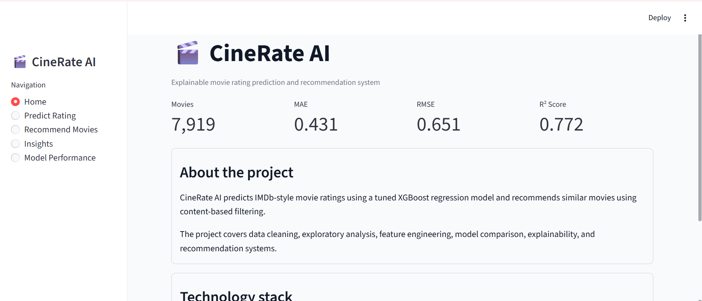
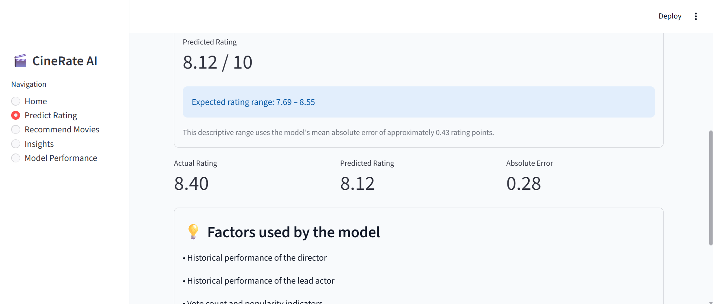
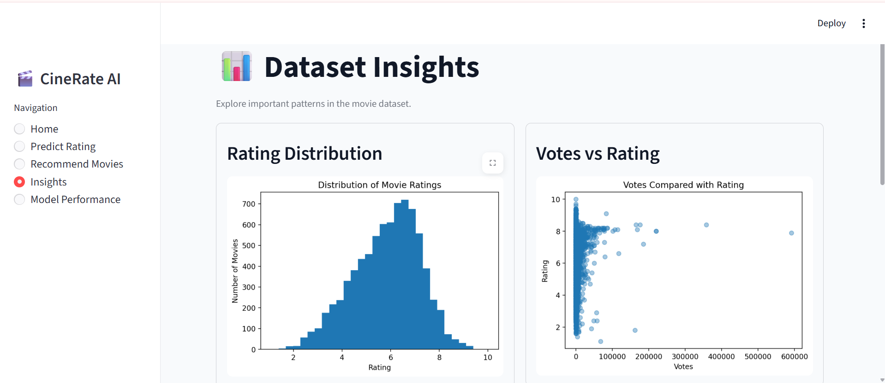
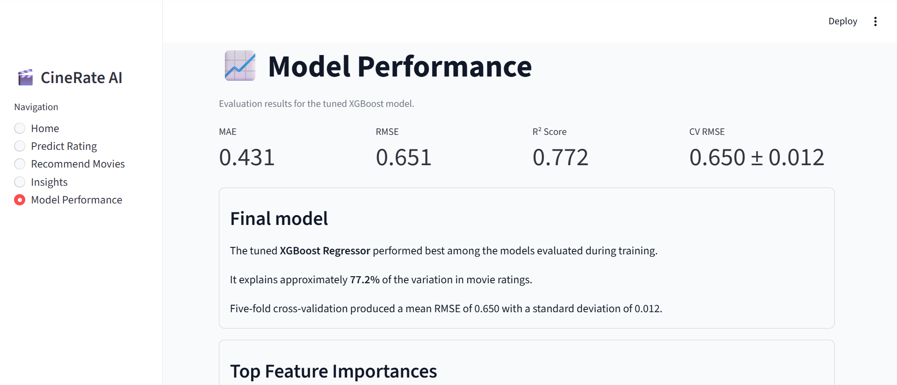
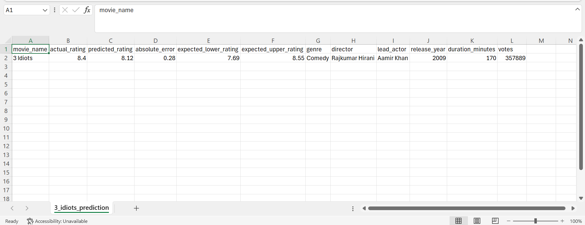

# 🎬 CineRate AI - Movie Rating Prediction & Recommendation System

An end-to-end Machine Learning application that predicts IMDb-style movie ratings and recommends similar movies using content-based filtering. Built with Python, XGBoost, and Streamlit, the project demonstrates the complete machine learning workflow from data preprocessing to deployment through an interactive web application.

---

## 📌 Project Overview

CineRate AI predicts the IMDb-style rating of a movie based on attributes such as genre, director, lead actor, release year, duration, and popularity. Alongside rating prediction, the application recommends similar movies using a content-based recommendation system powered by TF-IDF Vectorization and Cosine Similarity.

The project demonstrates practical machine learning concepts including:

- Data Cleaning & Preprocessing
- Exploratory Data Analysis (EDA)
- Feature Engineering
- Regression Modeling
- Hyperparameter Tuning
- Model Evaluation
- Recommendation Systems
- Interactive Dashboard Development

---

# ✨ Features

- 🎯 Movie Rating Prediction using a tuned XGBoost Regressor
- 🎬 Content-Based Movie Recommendation System
- 📊 Interactive Streamlit Dashboard
- 📈 Exploratory Data Analysis & Visualizations
- 🤖 Actual vs Predicted Rating Comparison
- 📉 Model Performance Metrics
- 📄 Download Prediction Report (CSV)
- 📋 Feature Importance Analysis
- 💡 Explainable Machine Learning Workflow

---

# 🛠️ Tech Stack

### Programming Language

- Python

### Data Analysis

- Pandas
- NumPy

### Machine Learning

- Scikit-learn
- XGBoost

### Visualization

- Matplotlib
- Seaborn

### Model Serialization

- Joblib

### Deployment

- Streamlit

### Recommendation System

- TF-IDF Vectorization
- Cosine Similarity

---

# 📂 Project Structure

```text
CineRate-AI/
│
├── app/
│   └── app.py
│
├── notebooks/
│   ├── 1_data_cleaning.ipynb
│   ├── 2_eda.ipynb
│   ├── 3_feature_engineering.ipynb
│   ├── 4_model_training.ipynb
│   ├── 5_model_evaluation.ipynb
│   └── 6_recommendation_system.ipynb
│
├── data/
│   ├── imdb_features.csv
│   └── recommendation_movies.csv
│
├── models/
│   ├── movie_rating_xgb_model.pkl
│   ├── model_features.pkl
│   ├── cosine_similarity.pkl
│   ├── movie_indices.pkl
│   └── feature_importance_xgb.csv
│
├── images/
│   ├── 01_home_page.png
│   ├── 02_predict_rating.png
│   ├── 03_recommendation_system.png
│   ├── 04_dataset_insights.png
│   ├── 05_model_performance.png
│   └── 06_prediction_report.png
│
├── requirements.txt
├── README.md
└── .gitignore
```

---

# 📸 Application Preview

## 1️⃣ Home Page

The landing page provides an overview of the application along with key project metrics and navigation.



---

## 2️⃣ Movie Rating Prediction

Select a movie from the dataset to predict its IMDb-style rating. The application displays the predicted rating, actual rating, prediction error, and expected prediction range.



---

## 3️⃣ Movie Recommendation System

Recommend similar movies using a content-based recommendation system built with TF-IDF Vectorization and Cosine Similarity.


---

## 4️⃣ Dataset Insights

Interactive visualizations providing insights into movie ratings, genres, and voting patterns.



---

## 5️⃣ Model Performance

Evaluate the trained model using regression metrics and feature importance.



---

## 6️⃣ Prediction Report

Download a detailed CSV report containing the predicted rating, actual rating, prediction error, expected rating range, and movie details.



---

# 🔄 Machine Learning Workflow

```text
IMDb Movie Dataset
        │
        ▼
Data Cleaning & Preprocessing
        │
        ▼
Exploratory Data Analysis
        │
        ▼
Feature Engineering
        │
        ▼
Model Training
        │
        ▼
Hyperparameter Tuning
        │
        ▼
Model Evaluation
        │
        ▼
Movie Rating Prediction
        │
        ▼
Content-Based Recommendation System
        │
        ▼
Interactive Streamlit Application
```

---

# 📈 Model Performance

The Tuned XGBoost Regressor achieved the best performance among all evaluated models.

| Metric | Score |
|---------|------:|
| MAE | **0.431** |
| RMSE | **0.651** |
| R² Score | **0.772** |
| Mean CV RMSE | **0.650** |
| Cross Validation Std. Dev. | **0.012** |

The model explains approximately **77% of the variance** in movie ratings and demonstrates stable performance across five-fold cross-validation.

---

# 🚀 Getting Started

## Clone the Repository

```bash
git clone https://github.com/nikhitad01/CineRate-AI.git
```

## Navigate to the Project Directory

```bash
cd CineRate-AI
```

## Install Dependencies

```bash
pip install -r requirements.txt
```

## Run the Streamlit Application

```bash
streamlit run app/app.py
```

---

# 📊 Dataset

**Dataset:** IMDb India Movies Dataset

The dataset contains movie metadata including:

- Movie Name
- Genre
- Director
- Lead Actor
- Release Year
- Duration
- Number of Votes
- IMDb Rating

---

# 🎯 Key Learning Outcomes

Through this project, I gained hands-on experience in:

- Data preprocessing and feature engineering
- Regression modeling using XGBoost
- Hyperparameter tuning and model optimization
- Model evaluation using regression metrics
- Content-based recommendation systems
- Building interactive dashboards with Streamlit
- Deploying machine learning workflows into user-friendly applications

---

# 🔮 Future Enhancements

- Movie poster integration using TMDb API
- Hybrid recommendation system
- Personalized movie recommendations
- Cloud deployment
- Enhanced recommendation explanations

---

# 👩‍💻 Author

**Nikhita Darshanala**

- GitHub: https://github.com/nikhitad01
- LinkedIn: https://www.linkedin.com/in/nikhita01/

---

## ⭐ If you found this project helpful, consider giving it a star!