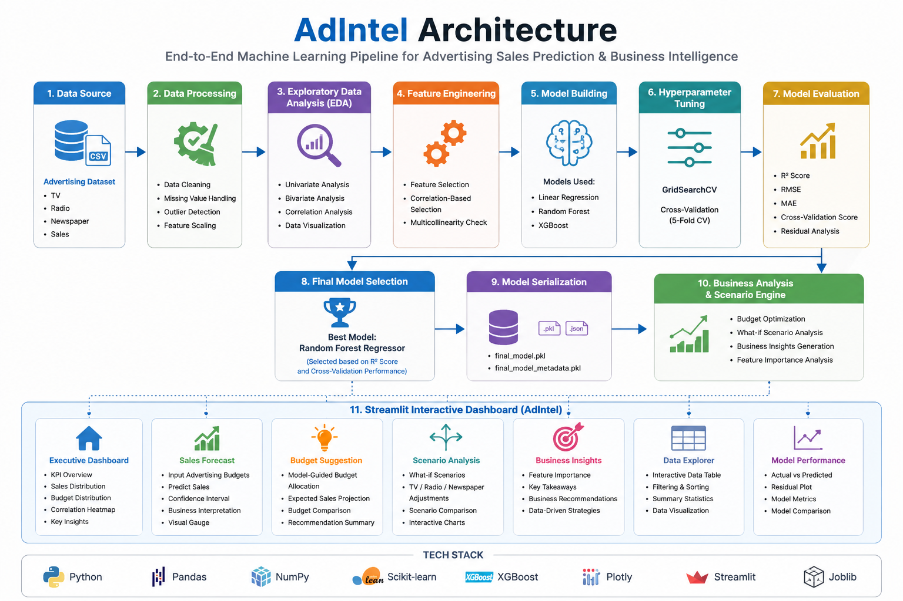
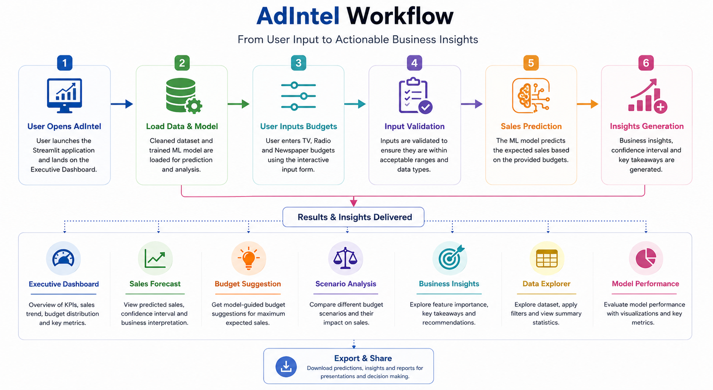
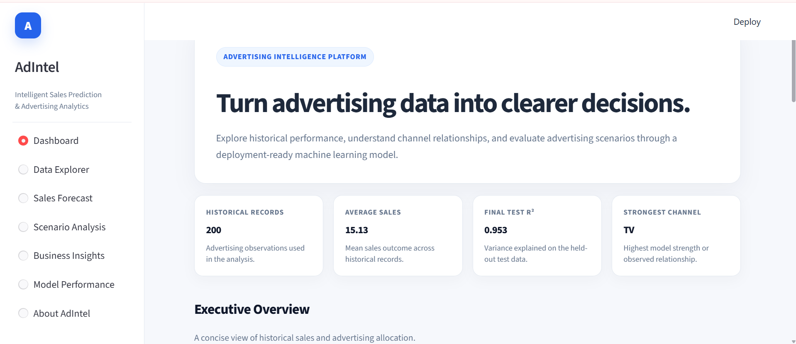
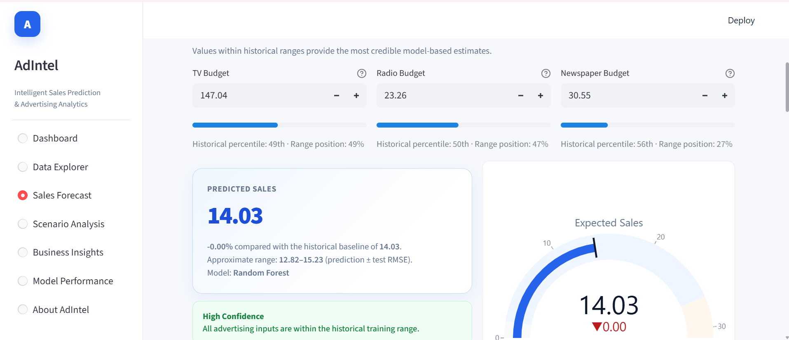
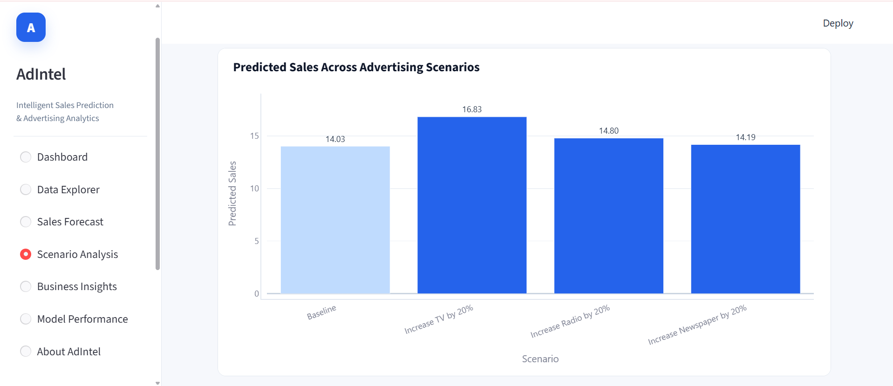
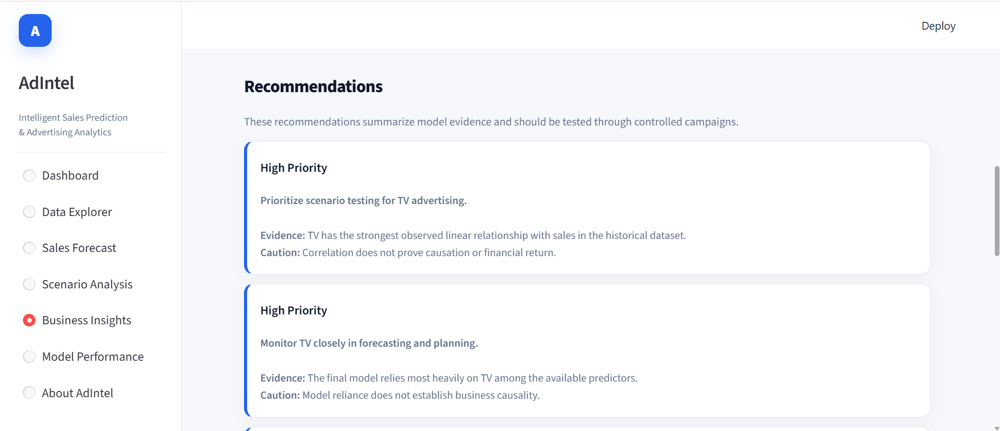
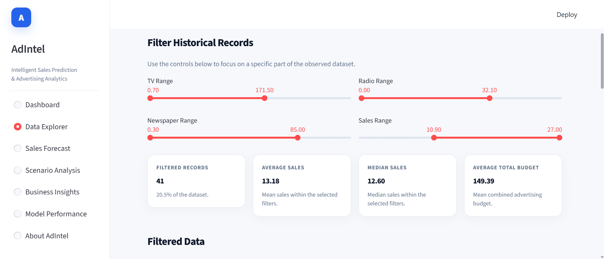
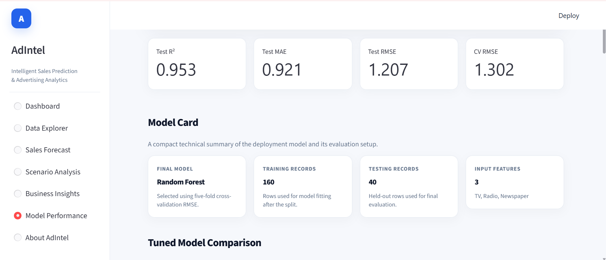
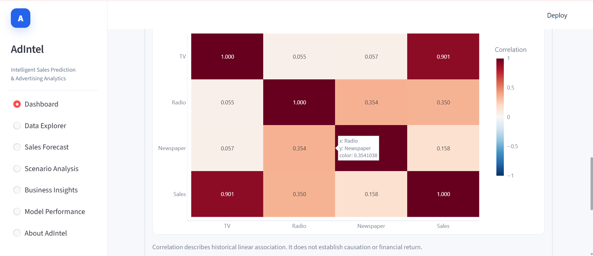

# 📊 AdIntel – Advertising Sales Prediction & Business Intelligence Dashboard

> **An end-to-end Machine Learning application that predicts product sales from advertising budgets and transforms predictions into actionable business insights through an interactive Streamlit dashboard.**
---

# 🌟 Project Overview

Advertising is one of the biggest drivers of product sales, but deciding **how much to invest across different advertising channels** is a common business challenge.

**AdIntel** is an end-to-end Machine Learning project that predicts product sales using advertising investments across **TV, Radio, and Newspaper** channels. Beyond prediction, the application provides interactive business insights, scenario analysis, model evaluation, and data exploration through a professional Streamlit dashboard.

The project demonstrates the complete data science lifecycle—from raw data preprocessing and exploratory analysis to model development, evaluation, and deployment.

---

# 🎯 Objectives

* Predict product sales from advertising budgets.
* Compare multiple machine learning models.
* Identify the best-performing model through evaluation.
* Enable interactive scenario analysis.
* Support marketing decision-making using business insights.
* Present results through an intuitive analytics dashboard.

---

# 🏗️ System Architecture

<p align="center">

</p>

---

# 🔄 Project Workflow

<p align="center">

</p>

---

# ✨ Features

### 📈 Machine Learning

* Data Cleaning & Preprocessing
* Feature Engineering
* Multiple Model Comparison
* Hyperparameter Tuning
* Final Model Selection
* Model Evaluation

### 📊 Interactive Dashboard

* Executive Dashboard
* Sales Forecast
* Scenario Analysis
* Business Insights
* Model Performance
* Interactive Data Explorer

### 📋 Business Analytics

* Budget Allocation Analysis
* Prediction Confidence Indicator
* Scenario Comparison
* Feature Importance
* Downloadable Prediction Reports
* Marketing Decision Support

---

# 🛠️ Tech Stack

| Category            | Technologies                |
| ------------------- | --------------------------- |
| Programming         | Python                      |
| Data Analysis       | Pandas, NumPy               |
| Visualization       | Plotly, Matplotlib, Seaborn |
| Machine Learning    | Scikit-learn, XGBoost       |
| Model Serialization | Joblib                      |
| Dashboard           | Streamlit                   |
| Development         | Jupyter Notebook, Git       |

---

# 📂 Project Structure

```text
AdIntel/
│
├── app/
│   └── app.py
│
├── data/
│   ├── raw/
│   └── processed/
│
├── images/
│   ├── 01_architecture.png
│   ├── 02_workflow.png
│   ├── 03_dashboard.png
│   ├── 04_sales_prediction.png
│   ├── 05_scenario_analysis.png
│   ├── 06_business_insights.png
│   ├── 07_data_explorer.png
│   ├── 08_model_performance.png
│   ├── 09_correlation_heatmap.png
│   └── demo.gif
│
├── models/
│
├── notebooks/
│   ├── 01_Data_Cleaning.ipynb
│   ├── 02_EDA.ipynb
│   ├── 03_Feature_Engineering.ipynb
│   ├── 04_Model_Building.ipynb
│   ├── 05_Hyperparameter_Tuning.ipynb
│   └── 06_Business_Analysis.ipynb
│
├── reports/
│
├── README.md
├── requirements.txt
└── .gitignore
```

---

# 📸 Application Preview

## Executive Dashboard

<p align="center">

</p>

---

## Sales Forecast

<p align="center">

</p>

---

## Scenario Analysis

<p align="center">

</p>

---

## Business Insights

<p align="center">

</p>

---

## Data Explorer

<p align="center">

</p>

---

## Model Performance

<p align="center">

</p>

---

## Correlation Heatmap

<p align="center">

</p>

---

# 🤖 Machine Learning Pipeline

1. Data Collection
2. Data Cleaning & Validation
3. Exploratory Data Analysis (EDA)
4. Feature Engineering
5. Train-Test Split
6. Model Training
7. Hyperparameter Tuning
8. Model Evaluation
9. Business Analysis
10. Streamlit Deployment

---

# 📊 Models Evaluated

* Linear Regression
* Random Forest Regressor ✅
* XGBoost Regressor

The final model was selected based on predictive performance using cross-validation and evaluated on a held-out test dataset.

---

# 📈 Model Evaluation

The project evaluates model performance using:

* R² Score
* Mean Absolute Error (MAE)
* Root Mean Squared Error (RMSE)
* Cross-Validation
* Actual vs Predicted Analysis
* Residual Analysis
* Feature Importance

---

# 💼 Business Use Cases

* Marketing Budget Planning
* Advertising Spend Optimization
* Sales Forecasting
* Campaign Scenario Analysis
* Marketing Decision Support
* Data-Driven Business Insights

---

# 🚀 Getting Started

## Clone the repository

```bash
git clone https://github.com/nikhitad01/AdIntel.git
```

```bash
cd AdIntel
```

---

## Install dependencies

```bash
pip install -r requirements.txt
```

---

## Run the application

```bash
streamlit run app/app.py
```

---

# 📋 Future Improvements

* Time-series sales forecasting
* Support for larger multi-channel marketing datasets
* Advanced model explainability
* Automated model retraining
* Cloud deployment

---

# 👩‍💻 Author

## **Nikhita Darshanala**

**Final-Year B.E. Computer Science (Data Science)**

📧 Email: [nikhitadarshanala@gmail.com](mailto:nikhitadarshanala@gmail.com)

🔗 LinkedIn: https://linkedin.com/in/nikhita01

💻 GitHub: https://github.com/nikhitad01

---

> **AdIntel demonstrates the complete machine learning lifecycle—from raw data to business-ready insights—through an interactive analytics application built with Python, Scikit-learn, Plotly, and Streamlit.**
