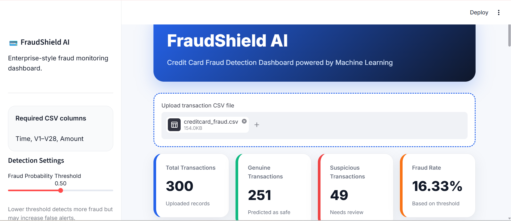
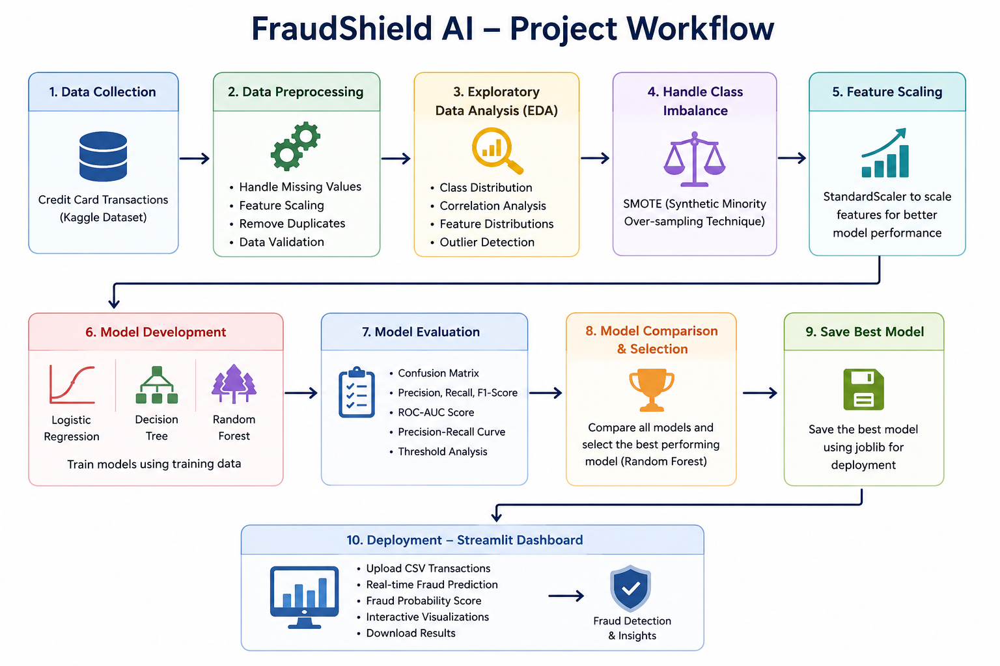
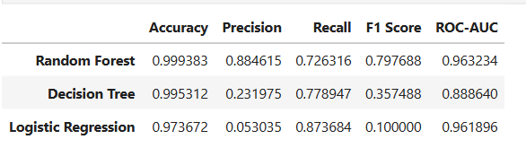
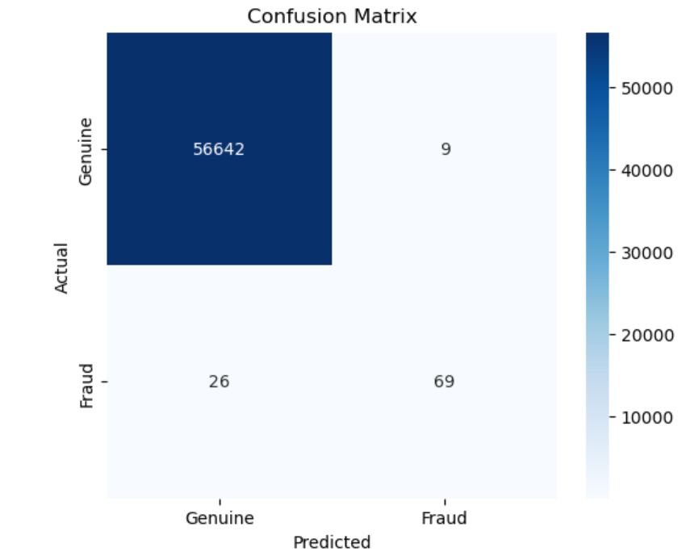
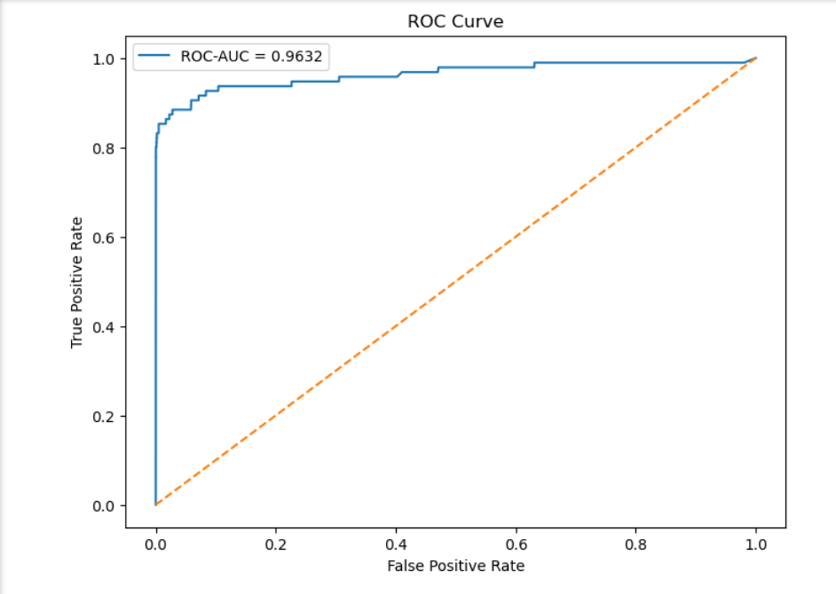

# 💳 FraudShield AI

### Machine Learning-Powered Credit Card Fraud Detection Dashboard

> An end-to-end machine learning project for detecting fraudulent credit card transactions using multiple machine learning models and an interactive Streamlit dashboard.



---

## 📌 Overview

Credit card fraud is one of the biggest challenges faced by financial institutions due to the massive number of daily transactions and the rarity of fraudulent activities.

**FraudShield AI** is an end-to-end machine learning solution designed to identify suspicious credit card transactions. The project covers the complete machine learning lifecycle—from data preprocessing and handling class imbalance to model comparison, evaluation, and deployment through an interactive Streamlit dashboard.

---

## ✨ Features

- 📊 Exploratory Data Analysis (EDA)
- 🧹 Data preprocessing and feature scaling
- ⚖️ Class imbalance handling using SMOTE
- 🤖 Multiple machine learning models
  - Logistic Regression
  - Decision Tree
  - Random Forest
- 📈 Model comparison using fraud-specific evaluation metrics
- 🎯 Threshold tuning
- 💻 Interactive Streamlit dashboard
- 📂 CSV upload for batch prediction
- 📊 Interactive visualizations with Plotly
- 📥 Download prediction results

---

# 📂 Dashboard Demo

### Upload Transaction Dataset


The dashboard allows users to upload transaction datasets in CSV format and automatically performs fraud prediction using the trained machine learning model.

---

# 🏗 Project Workflow



---

# 📂 Project Structure

```text
FraudShield-AI/
│
├── app/
│   └── streamlit_app.py
│
├── data/
│   ├── raw/
│   └── processed/
│
├── images/
│   ├── 01_dashboard.png
│   ├── 02_upload_demo.png
│   ├── 03_workflow.png
│   ├── 04_model_comparison.png
│   ├── 05_confusion_matrix.png
│   └── 06_roc_curve.png
│
├── models/
│   ├── best_model.pkl
│   └── scaler.pkl
│
├── notebooks/
│   ├── 01_Data_Understanding_and_EDA.ipynb
│   ├── 02_Data_Preprocessing.ipynb
│   ├── 03_Model_Development.ipynb
│   ├── 04_Model_Evaluation.ipynb
│   └── 05_Business_Insights.ipynb
│
├── requirements.txt
├── README.md
└── .gitignore
```

---

# 🧠 Machine Learning Pipeline

1. Data Understanding & Exploratory Data Analysis
2. Data Cleaning & Preprocessing
3. Feature Scaling
4. Train-Test Split
5. Handle Class Imbalance using SMOTE
6. Train Multiple Classification Models
7. Evaluate Model Performance
8. Select the Best Performing Model
9. Deploy with Streamlit

---

# 🤖 Models Used

| Model | Purpose |
|--------|---------|
| Logistic Regression | Baseline Classification Model |
| Decision Tree | Tree-based Classification |
| Random Forest | Final Selected Model |

---

# 📊 Model Comparison



The performance of multiple machine learning models was evaluated using fraud-specific metrics including Precision, Recall, F1-score, and ROC-AUC. Random Forest achieved the best overall performance and was selected for deployment.

---

# 📈 Model Evaluation

### Confusion Matrix



### ROC Curve



---

# 📊 Final Performance

| Metric | Score |
|---------|-------:|
| Precision | **0.8846** |
| Recall | **0.7263** |
| F1 Score | **0.7977** |
| ROC-AUC | **0.9632** |
| Average Precision | **0.7942** |

### Key Insights

- High precision minimizes false fraud alerts.
- Strong recall ensures most fraudulent transactions are detected.
- ROC-AUC of **0.9632** demonstrates excellent discrimination capability.
- Threshold tuning helps balance fraud detection performance and false positives.

---

# 🛠 Tech Stack

### Programming

- Python

### Machine Learning

- Scikit-learn
- Imbalanced-Learn (SMOTE)

### Data Analysis

- Pandas
- NumPy

### Visualization

- Matplotlib
- Seaborn
- Plotly

### Deployment

- Streamlit

---

# ⚙ Installation

Clone the repository

```bash
git clone https://github.com/nikhita01/FraudShield-AI.git
```

Navigate to the project directory

```bash
cd FraudShield-AI
```

Install dependencies

```bash
pip install -r requirements.txt
```

Run the application

```bash
streamlit run app/streamlit_app.py
```

---

# 📁 Dataset

**Dataset:** Credit Card Fraud Detection Dataset

**Source:** https://www.kaggle.com/datasets/mlg-ulb/creditcardfraud

---

# 🎯 Future Improvements

- Explainable AI using SHAP
- XGBoost and LightGBM implementation
- Hyperparameter optimization
- Real-time fraud detection API
- Cloud deployment
- Model monitoring and drift detection

---

# 👩‍💻 Author

**Nikhita Darshanala**